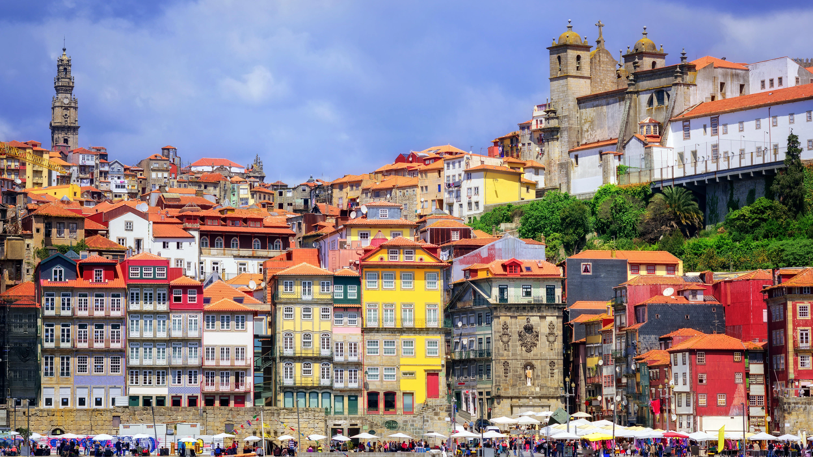

# Portugal-2023

Tur til **Portugal**!! med *tiger*. Bildet viser gamlebyen i Porto.

| <h2>Utreise</h2>  | <h2>Hjemreise</h2> | 
| ------------- | ------------- |
| <h3>30. juli</h3>  | <h3>12. august</h3>  |

## Økonomi
Budsjett: 2x20 000,- => 40 000,-

### Transport
**Flybilletter:** 
- OSL -> OPO: 2x1589,-
- LIS -> OSL: 2x2385,-

**Togbilletter:**
- Ca 1200,- for alle reiser (OPO-FAO, 

**Delsum:**
*9148,-*
### Bokostnader
- Guest House (Porto, 31.07-04.08): 4252,-
- Urban Camping (Faro, 04.08-05.08): 1075,-
- Guest House (Lagos, 05.08-09.08): 5052,-
- 5 Hotel (Lisboa, 09.08-12.08): 3871,-

**Delsum:** 
*14,250,-*

### Oppsummert
Gjenstående saldo: *16,602,-*

## Reiseplan (transport)

### Kjøre til Oslo fra Bergen
Reisedetailer:
- Kjøre fra Bergen Søndag 30. juli

### Fly til Porto fra Oslo 31. juli
Reisedetaljer:
- Take-off: Mandag 31. juli 17:10
- Landing: Mandag 31. juli 19:50

Deretter:
- Taxi fra flyplass til Dukes Corner Guest House

### Tog til Faro 4. august
- Kan bestille tog 90 dager i forveien (6. mai)
- Tiger skriver dette ned.

## Bil eller tog videre til Lagos 05. august
- Kan enten leie bil og kjøre eller ta tog hit fra Faro
- Mulighet til å besøke Albufeira på veien?

### Tog til Lisboa 9. august 
- Kan bestille tog 90 dager i forveien (9-10. mai)

### Fly til Oslo fra Lisboa 12. august
Reisedetaljer:
- Take-off: Lørdag 12. august 07:00
- Landing: Lørdag 12. august 12:00

### Kjøre til Bergen
Reiseplan:
- Kjøre fra Oslo Søndag 13. august

## Porto
Porto er den anstørste byen i Portugal og ligger nord i landet.
Porto har en veldig gammel trikk. Trikken koster 5 euro hver vei.
Det er veldig bratt i Porto, husk gode sko.

### Aktiviteter
- Sightseeing (city life (wohoo!))
- Restauranter
- Drikke masse vin
- Spise Francesinha på ett(!) av disse stedene:
    - Café Santiago
    - Bufete Fase
    - Cervejaria Brasão
    - Conga
    - Capa Negra II

- Drikke:
	- Vinho Verde, søt og lettdrikkelig hvitvin
	- 
#### Note: Tiger er veldig skeptisk til Francesinha.

#### 1. Besøke vingård (Porto)

https://www.viator.com/tours/Porto/Around-Douro-Valley-Tour-Full-Day/d26879-12784P4

## Lisboa
Hovedstaden til Portugal er Lisboa.

### Aktiviteter
- Sightseeing (city life)
- Restauranter
- Nyte en Pastel de nata på Pasteis de Belém

## Algarve
Regionen langs sørkysten av Portugal heter Algarve.

### Aktiviteter
- Surfing
- Klatring
- Turer i landskapet
- Blokarting

## Aktivitetskrav

### Å spise
- Pastel de nata

### Båttur er et must
Helst på en seilbåt, eller en yacht (vi får se >:) - Tiger)

### Surfing

### Stranden

### Drikke masse portugisisk vin

Lenker til aktiviteter (guided):

### Båttur til Berlanga (Lisboa)
https://www.viator.com/tours/Lisbon/Berlenga-Grande-Island-Small-Group-Day-Trip-from-Lisbon/d538-6999SMLATLANTIC

### Kajakk i huler (Algarve)

https://www.tripadvisor.com/AttractionProductReview-g12741809-d16807849-Kayaking_in_Secret_Algarve_Benagil_Caves-Benagil_Lagoa_Faro_District_Algarve.html
